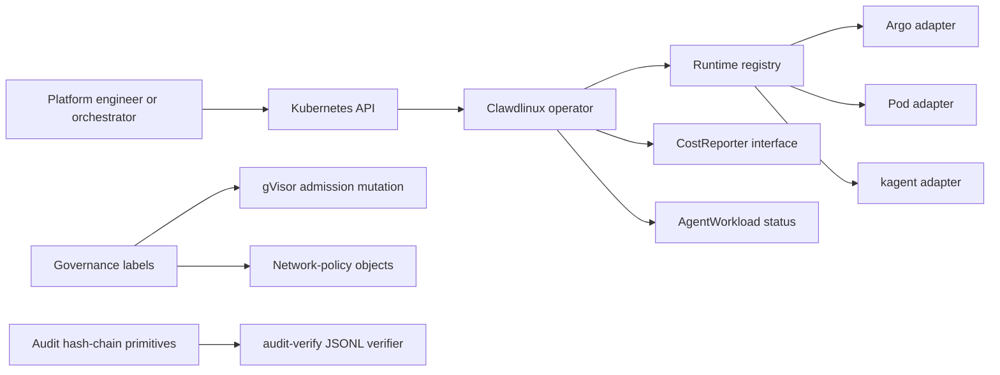

<p align="center">
  
</p>

<h1 align="center">Clawdlinux Operator</h1>

<p align="center">
  <strong>In-cluster governance for AI agents on Kubernetes.</strong>
</p>

<p align="center">
  Runtime-agnostic workload contracts, isolation and egress configuration, model-cost evidence, and offline-verifiable audit primitives.
</p>

<p align="center">
  <!-- Core -->
  <a href="LICENSE"></a>
  <a href="go.mod"></a>
  <a href="https://github.com/Clawdlinux/agentic-operator-core/actions/workflows/ci.yml"></a>
  <a href="https://github.com/Clawdlinux/agentic-operator-core/actions/workflows/test-gates.yml"></a>
</p>

<p align="center">
  <!-- Ecosystem -->
  
  
  
  
  
  
</p>

<p align="center">
  <!-- Actions -->
  <a href="docs/01-quickstart.md"></a>
  <a href="https://clawdlinux.org"></a>
  <a href="https://discord.gg/2yJsjhPe"></a>
  <a href="docs/04-architecture.md"></a>
  <a href="CONTRIBUTING.md"></a>
</p>

---

## Why Clawdlinux?

Platform teams running AI agents on Kubernetes face the same regulated-ops questions regardless of which agent runtime they use.

Who can the agent call? Which runtime isolates it? What did it cost? What did it do? Can an auditor replay it later?

Clawdlinux is building the in-cluster governance boundary around those workloads. It does not replace the agent runtime.

The repository currently ships the `AgentWorkload` lifecycle, runtime adapters, admission mutation, generated network-policy objects, model routing and cost paths, and HMAC hash-chain verification primitives. These components have different integration depth. The current controller does not yet emit a complete signed artifact from each run.

The target contract connects caller identity, declared access, action policy, approval, cost, outcome, and independently verifiable evidence in one transaction. That target is the product direction, not a claim about the current end-to-end path.

| Capability | Current repository state |
|---|---|
| Runtime isolation | gVisor `RuntimeClass` mutation for labeled pods; nodes must provide `runsc` |
| Network controls | Default-deny and allow-list policy generation; enforcement depends on the cluster CNI |
| Audit | HMAC hash-chain and JSONL verifier; automatic same-run capture is not connected |
| Cost | Per-workload usage and estimated-cost paths plus chargeback hooks |
| Context | ANF view snapshots (internal tooling): `agentctl` renders token-minimal Kubernetes and agent state for the model |
| Delivery | Helm packaging and offline JWT validation; full air-gapped install testing remains a release gate |
| Orchestration | Argo Workflows DAG orchestration |

### Supported runtimes

Clawdlinux currently registers 3 Kubernetes runtime adapters:

- **Clawdlinux AgentWorkload** (built-in CRD)
- **CNCF agent runtimes** like kagent
- **Custom agent pods** with the right labels

The runtime handles agent lifecycle, tools, and model dispatch. Clawdlinux supplies workload, policy, isolation, cost, and evidence primitives around it. A production integration must map those controls to the customer's identity, network, storage, and compliance program.

| Problem | Clawdlinux |
|---------|-----------------|
| Agent sprawl across namespaces | Single `AgentWorkload` CRD per agent |
| No network boundaries | Kubernetes and optional Cilium policy objects generated from reviewed configuration |
| Invisible costs | Per-workload token metering + cost attribution |
| Manual DAG wiring | Argo Workflows orchestrates agent steps |
| Vendor lock-in | Any LLM via LiteLLM proxy routing |
| Cloud-only control planes | Self-managed, in-cluster deployment with offline licensing support |

### Runtime sandbox for labeled pods

Any agent deployment can opt into Clawdlinux's gVisor injector with one label:

```yaml
agentic.clawdlinux.org/runtime-sandbox: gvisor
```

The Clawdlinux webhook mutates matching Pods on create:

```yaml
runtimeClassName: gvisor
```

No fork required. No custom build required. Works with any pod that carries the label.

---

## Demo

```bash
kubectl apply -f config/samples/agentworkload_demo.yaml
kubectl -n agentic-system get agentworkloads -w
```

For the reproducible evidence demo, use
[`docs/SHOWCASE-DEMO-WALKTHROUGH.md`](docs/SHOWCASE-DEMO-WALKTHROUGH.md).
It labels current-run, configuration-only, and prior-run evidence separately.

---

## Agent-callable API (MCP)

Clawdlinux's `AgentWorkload` CRD is already an agent-readable interface — agents
can read the schema and reason about the spec. `agentctl mcp serve` is the
**wire-protocol** surface so an external orchestrator agent (Claude Desktop,
Cursor, ChatGPT, custom Python) can provision its own Clawdlinux execution
environments without a human running `kubectl`.

```bash
export CLAWDLINUX_MCP_TOKEN=$(uuidgen)
agentctl mcp serve --addr :8765 --default-namespace agentic-system
```

Six tools, 1:1 with CRD verbs: `create_workload`, `get_workload_status`,
`list_workloads`, `get_workload_logs`, `get_workload_cost`, `delete_workload`.
Full reference in [`docs/agentctl/mcp.md`](docs/agentctl/mcp.md). Examples in
[`examples/mcp-claude-desktop/`](examples/mcp-claude-desktop) and
[`examples/mcp-orchestrator/`](examples/mcp-orchestrator).

---

## Quick Start

**Option A — One command (requires kind + helm):**
```bash
curl -sSL https://raw.githubusercontent.com/Clawdlinux/agentic-operator-core/main/scripts/install.sh | bash
```

**Option B — Step by step:**
```bash
git clone https://github.com/Clawdlinux/agentic-operator-core
cd agentic-operator-core

# Create local cluster
kind create cluster --name agentic-operator

# Install CRD + operator
kubectl apply -f config/crd/agentworkload_crd.yaml
helm dependency build ./charts
helm upgrade --install agentic-operator ./charts \
  --namespace agentic-system --create-namespace \
  --set license.key=dev-only-not-a-valid-license

# The development license value is packaging-only in OSS mode.
# Do not use it in production.

# Deploy your first agent
kubectl apply -f config/agentworkload_example.yaml
kubectl -n agentic-system get agentworkloads -w
```

**Option C — GitHub Codespaces (zero local setup):**

[](https://codespaces.new/Clawdlinux/agentic-operator-core?devcontainer_path=.devcontainer/devcontainer.json)

---

## Architecture



The operator selects `argo`, `pod`, or `kagent` through `pkg/runtime.Registry`.
Adapters stamp shared governance labels. The admission webhook and network-policy
templates consume those labels. Actual sandboxing requires gVisor on the nodes.
Network enforcement depends on the cluster CNI.

The audit package and offline JSONL verifier are implemented. The controller does
not yet append each run event into that chain. Durable storage, production signing
keys, and independently verified checkpoints remain integration work.

---

## What's Included

| Component | Description |
|-----------|-------------|
| **AgentWorkload CRD** | Declarative spec for agent objective, model, quotas, egress rules |
| **Controller** | Reconciles workloads → namespaces, network policies, workflows, artifacts |
| **Argo Integration** | Agent steps execute as DAG nodes with retries and timeouts |
| **Network policy** | Default-deny and allow-list policy templates; optional Cilium FQDN policy |
| **Model Routing** | Operator classifier plus optional LiteLLM multi-provider proxy |
| **MinIO** | Optional in-cluster object storage subchart; same-run audit bundling is not connected |
| **Multi-tenancy** | Namespace isolation with quota enforcement per tenant |
| **Cost Attribution** | CostReporter interface, no-op default, and in-memory demo reporter |
| **Python Agent Runtime** | Batteries-included agent framework with tool integrations |

---

## Project Status

| Available in this repository | Target product work |
|---|---|
| AgentWorkload CRD and runtime adapters | Actor identity propagated into every run |
| Argo DAG and BYO pod execution | Universal tool-call mediation |
| Admission mutation and policy-object generation | Enforcing-cluster packet tests |
| Model routing and cost-reporting interfaces | Durable cost and chargeback integration |
| Audit hashing, signing, and JSONL verification | Same-run capture, durable storage, and external checkpoints |

Clawdlinux does not claim compliance certification. It provides technical
controls that customers can map into their own security and compliance program.

---

## Security & Sandbox

The Helm chart renders default-deny egress NetworkPolicies for selected pods
when `networkPolicy.enabled=true`. It can also create a gVisor `RuntimeClass`
and register a mutating webhook for labeled pods. The cluster must provide an
enforcing CNI and install `runsc`. See [docs/07-security.md](docs/07-security.md).

---

## Repository Layout

```
cmd/                    Operator entrypoint
internal/controller/    Reconciliation logic
api/v1alpha1/           CRD API types and schema
agents/                 Python agent runtime
charts/                 Helm umbrella chart
config/                 CRD, RBAC, sample manifests
docs/                   Documentation
pkg/                    Shared packages (billing, license, autoscaling, routing)
tests/                  Integration + E2E test suites
assets/                 Branding assets (logo, etc.)
```

---

## Documentation

| Doc | Description |
|-----|-------------|
| [Quick Start](docs/01-quickstart.md) | 5-minute setup guide |
| [Installation](docs/02-installation.md) | Production deployment options |
| [Configuration](docs/03-configuration.md) | CRD fields, Helm values, tuning |
| [Architecture](docs/04-architecture.md) | System design deep dive |
| [Multi-tenancy](docs/05-multi-tenancy.md) | Tenant isolation and quota enforcement |
| [Cost Management](docs/06-cost-management.md) | Per-workload billing and chargeback |
| [Security](docs/07-security.md) | Cilium, OPA, RBAC, and egress hardening |
| [Troubleshooting](docs/10-troubleshooting.md) | Common issues and fixes |

---

## Open Source Boundary

This repository is the **open-source core**. It supports self-managed Kubernetes
deployment and offline JWT validation. A reproducible full air-gap installation
test remains a release gate.

The [private companion](https://github.com/Clawdlinux/agentic-operator-private) adds enterprise features built on top of the core's cost-attribution primitives:
- License validation and trial enforcement
- External billing system integrations (e.g. OpenMeter, Stripe, internal chargebacks)
- Production DOKS deployment overlays
- Customer-specific security and compliance integrations

Neither repository alone makes a deployment compliant with a named framework.
Scope, controls, operations, and independent assessment remain customer-specific.

---

## Contributing

We welcome contributions! See [CONTRIBUTING.md](CONTRIBUTING.md) for guidelines.

```bash
# Fork, clone, create a branch
git checkout -b feat/my-improvement

# Run tests
make test

# Submit a PR
```

---

## Roadmap

See [ROADMAP.md](ROADMAP.md) for the public roadmap and quarterly milestones.

Design proposals in flight live in [`docs/rfcs/`](docs/rfcs/). Currently in design:

- **[RFC-0001: Cross-Cluster Agent Identity Federation (SPIFFE/SPIRE)](docs/rfcs/0001-cross-cluster-agent-identity.md)** — multi-cluster identity for agents in air-gapped and regulated environments. Validation gate: 6+ use cases or 1 paying customer. _GitHub Discussion opens shortly; track status in epic [#146](https://github.com/Clawdlinux/agentic-operator-core/issues/146)._

---

## Community

- **Discord** — [Join our Discord](https://discord.gg/r4QhZJQgV) for questions, discussions, and design partner conversations
- **Issues** — [Report bugs or request features](https://github.com/Clawdlinux/agentic-operator-core/issues)
- **Releases** — [Subscribe to releases](https://github.com/Clawdlinux/agentic-operator-core/releases) for changelog updates

---

## License

Apache License 2.0 — See [LICENSE](LICENSE).
