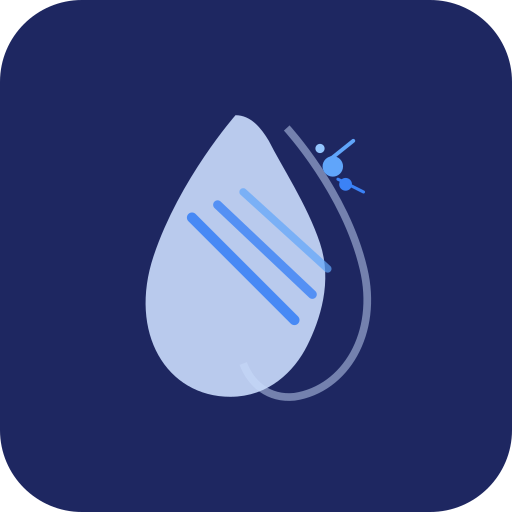
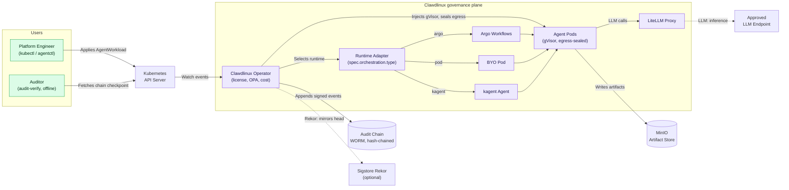

<p align="center">
  
</p>

<h1 align="center">Clawdlinux Operator</h1>

<p align="center">
  <strong>Air-gapped governance and attestation for AI agents on Kubernetes.</strong>
</p>

<p align="center">
  A tamper-evident attestation artifact and a zero-egress seal for every agent run. Air-gapped, verifiable offline, runtime-agnostic. Plus gVisor isolation, audit trails, and FinOps.
</p>

<p align="center">
  <!-- Core -->
  <a href="LICENSE"></a>
  <a href="go.mod"></a>
  <a href="https://github.com/Clawdlinux/agentic-operator-core/actions/workflows/ci.yml"></a>
  <a href="https://github.com/Clawdlinux/agentic-operator-core/actions/workflows/test-gates.yml"></a>
</p>

<p align="center">
  <!-- Ecosystem -->
  
  
  
  
  
  
</p>

<p align="center">
  <!-- Actions -->
  <a href="docs/01-quickstart.md"></a>
  <a href="https://clawdlinux.org"></a>
  <a href="https://discord.gg/2yJsjhPe"></a>
  <a href="docs/04-architecture.md"></a>
  <a href="CONTRIBUTING.md"></a>
</p>

---

## Why Clawdlinux?

Platform teams running AI agents on Kubernetes face the same regulated-ops questions regardless of which agent runtime they use.

Who can the agent call? Which runtime isolates it? What did it cost? What did it do? Can an auditor replay it later?

Clawdlinux is a governance plane that answers those questions. It adds regulated controls around any agent workload.

The wedge: Clawdlinux emits a signed, tamper-evident attestation artifact for each run and applies a zero-egress seal at the network boundary. The artifact is hash-chained and verifiable offline with `audit-verify`, so an auditor can replay what an agent did months later inside an air-gapped cluster. The same seal and attestation contract applies to a Clawdlinux AgentWorkload, a CNCF runtime, or your own labeled pods. This is the part most agent runtimes leave to you. Clawdlinux ships it in-cluster.

| Capability | What Clawdlinux provides |
|---|---|
| Runtime isolation | gVisor `RuntimeClass` injection for labeled pods |
| Audit | Tamper-evident audit chain |
| Cost | Per-workload budget and chargeback hooks |
| Context | ACP: governed execution contracts on top of MCP tool calls |
| Delivery | Air-gapped install path and offline licensing |
| Orchestration | Argo Workflows DAG orchestration |

### Supported runtimes

Clawdlinux works with any Kubernetes agent runtime:

- **Clawdlinux AgentWorkload** (built-in CRD)
- **CNCF agent runtimes** like kagent
- **Custom agent pods** with the right labels

The runtime handles agent lifecycle, tools, and model dispatch. Clawdlinux handles isolation, audit, spend, and compliance. Use both.

| Problem | Clawdlinux |
|---------|-----------------|
| Agent sprawl across namespaces | Single `AgentWorkload` CRD per agent |
| No network boundaries | Cilium FQDN egress policies auto-applied |
| Invisible costs | Per-workload token metering + cost attribution |
| Manual DAG wiring | Argo Workflows orchestrates agent steps |
| Vendor lock-in | Any LLM via LiteLLM proxy routing |
| Cloud-only runtimes | Full air-gapped, offline-first deployment |

### Runtime sandbox for labeled pods

Any agent deployment can opt into Clawdlinux's gVisor injector with one label:

```yaml
agentic.clawdlinux.org/runtime-sandbox: gvisor
```

The Clawdlinux webhook mutates matching Pods on create:

```yaml
runtimeClassName: gvisor
```

No fork required. No custom build required. Works with any pod that carries the label.

---

## Demo

```
$ kubectl apply -f agentworkload.yaml
agentworkload.agentic.clawdlinux.org/research-run created

$ kubectl get agentworkload research-run -w
NAME           PHASE       AGE
research-run   Pending     0s
research-run   Isolating   2s    # namespace + cilium policy applied
research-run   Running     5s    # argo workflow launched
research-run   Completed   47s   # artifacts retained in minio

$ kubectl logs -n aw-research-run agent-pod --tail=5
[agent] analyzing Q1 2026 technology trends...
[agent] sources: arxiv, github trending, HN front page
[agent] cost: $0.0023 (gpt-4o-mini) | tokens: 1,847 in / 892 out
[agent] output written to minio://research-run/report.md
[agent] run complete — 42s wall time
```

---

## Agent-callable API (MCP)

Clawdlinux's `AgentWorkload` CRD is already an agent-readable interface — agents
can read the schema and reason about the spec. `agentctl mcp serve` is the
**wire-protocol** surface so an external orchestrator agent (Claude Desktop,
Cursor, ChatGPT, custom Python) can provision its own Clawdlinux execution
environments without a human running `kubectl`.

```bash
export CLAWDLINUX_MCP_TOKEN=$(uuidgen)
agentctl mcp serve --addr :8765 --default-namespace agentic-system
```

Six tools, 1:1 with CRD verbs: `create_workload`, `get_workload_status`,
`list_workloads`, `get_workload_logs`, `get_workload_cost`, `delete_workload`.
Full reference in [`docs/agentctl/mcp.md`](docs/agentctl/mcp.md). Examples in
[`examples/mcp-claude-desktop/`](examples/mcp-claude-desktop) and
[`examples/mcp-orchestrator/`](examples/mcp-orchestrator).

---

## Quick Start

**Option A — One command (requires kind + helm):**
```bash
curl -sSL https://raw.githubusercontent.com/Clawdlinux/agentic-operator-core/main/scripts/install.sh | bash
```

**Option B — Step by step:**
```bash
git clone https://github.com/Clawdlinux/agentic-operator-core
cd agentic-operator-core

# Create local cluster
kind create cluster --name agentic-operator

# Install CRD + operator
kubectl apply -f config/crd/agentworkload_crd.yaml
helm dependency build ./charts
helm upgrade --install agentic-operator ./charts \
  --namespace agentic-system --create-namespace

# Deploy your first agent
kubectl apply -f config/agentworkload_example.yaml
kubectl -n agentic-system get agentworkloads -w
```

**Option C — GitHub Codespaces (zero local setup):**

[](https://codespaces.new/Clawdlinux/agentic-operator-core?devcontainer_path=.devcontainer/devcontainer.json)

---

## Architecture



The operator picks the execution runtime from `spec.orchestration.type` (Argo, a BYO pod, or a kagent Agent) through a pluggable adapter, then seals every agent pod (gVisor sandbox, default-deny egress to an approved allow-list) and appends a signed, hash-chained record of every run. The seal and attestation are identical across runtimes because they are enforced at the pod and network layer, not the scheduler. An auditor verifies the record offline, months later, with `audit-verify`.

---

## What's Included

| Component | Description |
|-----------|-------------|
| **AgentWorkload CRD** | Declarative spec for agent objective, model, quotas, egress rules |
| **Controller** | Reconciles workloads → namespaces, network policies, workflows, artifacts |
| **Argo Integration** | Agent steps execute as DAG nodes with retries and timeouts |
| **Cilium Policies** | FQDN-based egress lock-down auto-generated per workload |
| **LiteLLM Routing** | Cost-aware model selection across providers (OpenAI, Anthropic, Cloudflare) |
| **MinIO Artifacts** | Per-workload bucket for prompts, logs, outputs, audit trails |
| **Multi-tenancy** | Namespace isolation with quota enforcement per tenant |
| **Cost Attribution** | Per-workload usage metering and cost-attribution hooks for chargeback reporting |
| **Python Agent Runtime** | Batteries-included agent framework with tool integrations |

---

## Product Editions

| | Community | Enterprise |
|---|---|---|
| **License** | Apache 2.0 — free forever | Contact for pricing |
| **Deployment** | Self-managed | Managed + self-managed |
| **Air-gapped support** | ✅ | ✅ |
| **AgentWorkload CRD** | ✅ | ✅ |
| **Argo DAG orchestration** | ✅ | ✅ |
| **Cilium egress policies** | ✅ | ✅ |
| **Cost attribution hooks** | ✅ | ✅ |
| **Managed upgrades** | — | ✅ |
| **Dedicated control plane** | — | ✅ |
| **Private registry & SSO** | — | ✅ |
| **SLA + incident response** | — | ✅ |
| **FedRAMP / HIPAA advisory** | — | ✅ |

Enterprise inquiries: [shreyanshsancheti09@gmail.com](mailto:shreyanshsancheti09@gmail.com?subject=Enterprise%20Inquiry)

---

## Security & Sandbox

Clawdlinux ships **default-deny egress NetworkPolicies** for every agent namespace (Helm-toggleable via `networkPolicy.enabled`, default true). It can also create a gVisor `RuntimeClass` and register a pod mutating webhook for labeled agent pods. See [docs/07-security.md](docs/07-security.md) for details.

---

## Repository Layout

```
cmd/                    Operator entrypoint
internal/controller/    Reconciliation logic
api/v1alpha1/           CRD API types and schema
agents/                 Python agent runtime
charts/                 Helm umbrella chart
config/                 CRD, RBAC, sample manifests
docs/                   Documentation
pkg/                    Shared packages (billing, license, autoscaling, routing)
tests/                  Integration + E2E test suites
assets/                 Branding assets (logo, etc.)
```

---

## Documentation

| Doc | Description |
|-----|-------------|
| [Quick Start](docs/01-quickstart.md) | 5-minute setup guide |
| [Installation](docs/02-installation.md) | Production deployment options |
| [Configuration](docs/03-configuration.md) | CRD fields, Helm values, tuning |
| [Architecture](docs/04-architecture.md) | System design deep dive |
| [Multi-tenancy](docs/05-multi-tenancy.md) | Tenant isolation and quota enforcement |
| [Cost Management](docs/06-cost-management.md) | Per-workload billing and chargeback |
| [Security](docs/07-security.md) | Cilium, OPA, RBAC, and egress hardening |
| [Troubleshooting](docs/10-troubleshooting.md) | Common issues and fixes |

---

## Open Source Boundary

This repository is the **open-source core**. It contains everything needed to run agent workloads on Kubernetes, including full air-gapped support.

The [private companion](https://github.com/Clawdlinux/agentic-operator-private) adds enterprise features built on top of the core's cost-attribution primitives:
- License validation and trial enforcement
- External billing system integrations (e.g. OpenMeter, Stripe, internal chargebacks)
- Production DOKS deployment overlays
- FedRAMP / HIPAA compliance overlays

---

## Contributing

We welcome contributions! See [CONTRIBUTING.md](CONTRIBUTING.md) for guidelines.

```bash
# Fork, clone, create a branch
git checkout -b feat/my-improvement

# Run tests
make test

# Submit a PR
```

---

## Roadmap

See [ROADMAP.md](ROADMAP.md) for the public roadmap and quarterly milestones.

Design proposals in flight live in [`docs/rfcs/`](docs/rfcs/). Currently in design:

- **[RFC-0001: Cross-Cluster Agent Identity Federation (SPIFFE/SPIRE)](docs/rfcs/0001-cross-cluster-agent-identity.md)** — multi-cluster identity for agents in air-gapped and regulated environments. Validation gate: 6+ use cases or 1 paying customer. _GitHub Discussion opens shortly; track status in epic [#146](https://github.com/Clawdlinux/agentic-operator-core/issues/146)._

---

## Community

- **Discord** — [Join our Discord](https://discord.gg/r4QhZJQgV) for questions, discussions, and design partner conversations
- **Issues** — [Report bugs or request features](https://github.com/Clawdlinux/agentic-operator-core/issues)
- **Releases** — [Subscribe to releases](https://github.com/Clawdlinux/agentic-operator-core/releases) for changelog updates

---

## License

Apache License 2.0 — See [LICENSE](LICENSE).
