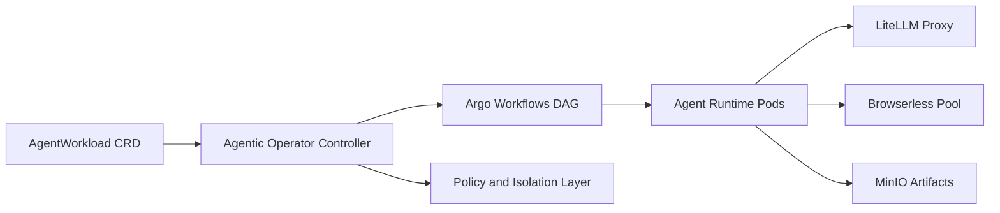

# Agentic Kubernetes Operator

Kubernetes operator for isolated, policy-aware AI agent workloads.

The Agentic Operator is the open-source core maintained by Nine Rewards Solutions Pvt Ltd under the Clawdlinux organization. It manages `AgentWorkload` CRDs, enforces workload boundaries, and orchestrates agent execution on Kubernetes.

## What It Does

- Reconciles `AgentWorkload` custom resources with idempotent controller loops
- Orchestrates agent DAG execution through Argo Workflows
- Applies policy-aware network isolation (including Cilium FQDN egress patterns)
- Routes LLM inference through a shared LiteLLM proxy
- Supports shared Browserless pool integration for browser automation workloads

## Prerequisites

- kind (for local clusters) or an existing Kubernetes cluster (k3s/DOKS)
- kubectl 1.24+
- Helm 3.12+
- Docker (required for kind local clusters)

## Quick Start (Cold Start Safe)

```bash
git clone https://github.com/Clawdlinux/agentic-operator-core
cd agentic-operator-core

# 1) Create local cluster
kind create cluster --name agentic-operator

# 2) Install CRD first
kubectl apply -f config/crd/agentworkload_crd.yaml

# 3) Install umbrella chart from local source
helm dependency build ./charts
helm upgrade --install agentic-operator ./charts \
	--namespace agentic-system \
	--create-namespace

# 4) Verify operator and CRD availability
kubectl get crd agentworkloads.agentic.clawdlinux.org
kubectl -n agentic-system get pods

# 5) Apply a working sample AgentWorkload
kubectl apply -f config/agentworkload_example.yaml
kubectl -n agentic-system get agentworkloads
```

If you are using a remote cluster, skip the `kind create cluster` step.

## Architecture Diagram



## Repository Layout

- `cmd/` - operator entrypoint
- `internal/controller/` - reconciliation logic
- `api/v1alpha1/` - CRD API types and schema
- `agents/` - Python agent runtime code
- `charts/` - Helm umbrella chart and subcharts
- `config/` - Kustomize and deployment manifests
- `docs/` - open-source documentation

## Open vs Private Boundary

Open source (`agentic-operator-core`) includes:

- AgentWorkload CRD lifecycle
- Argo DAG orchestration patterns
- Cilium isolation templates
- Generic agent scaffolding

Private (`agentic-operator-private`) includes:

- License validation and trial enforcement
- Usage metering and billing hooks
- Production DOKS enterprise deployment overlays

## Documentation

- [Quick Start](docs/01-quickstart.md)
- [Installation](docs/02-installation.md)
- [Configuration](docs/03-configuration.md)
- [Architecture](docs/04-architecture.md)
- [Troubleshooting](docs/10-troubleshooting.md)

## Contributing

See [CONTRIBUTING.md](CONTRIBUTING.md) for issue reporting, PR workflow, and review expectations.

## License

Apache License 2.0. See [LICENSE](LICENSE).
