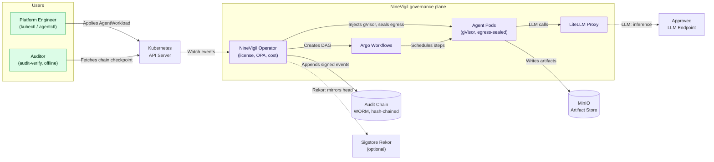

# Architecture

System design and components.

## Overview

NineVigil is a Kubernetes operator that runs autonomous AI agent workloads
under governance: sandboxed, egress-sealed, cost-attributed, and recorded in a
tamper-evident audit chain that an auditor can verify offline.

The Platform Engineer applies an `AgentWorkload`. The operator watches the API
server, injects a gVisor sandbox and a default-deny egress seal onto the agent
pods, and schedules the run through Argo. Agent pods reach only the approved
LLM endpoint (via the LiteLLM proxy) and write artifacts to MinIO. Every
consequential action is appended to a hash-chained, HMAC-signed audit chain,
with the chain head optionally mirrored to Sigstore Rekor. An auditor fetches
the published checkpoint and verifies the whole chain offline with
`audit-verify`, no trust in the cluster required.

## Components

### AgentWorkloadReconciler
Manages individual workload lifecycle:
- Task classification
- Model routing
- Provider execution
- Cost tracking
- Quality evaluation

### TenantReconciler
Provisions and manages tenants:
- Namespace creation
- Secret distribution
- RBAC configuration
- Quota enforcement
- SLA monitoring

### License Validator
Enforces licensing:
- JWT verification
- Tier validation
- Seat limits
- Expiry checks

### Cost Tracker
Tracks token usage:
- Per-provider accounting
- Monthly aggregation
- Quota enforcement
- Billing metrics

## Data Flow

1. **Workload Creation** → AgentWorkload CRD submitted
2. **Validation** → License check, policy evaluation
3. **Classification** → Task categorized (analysis/reasoning/validation)
4. **Routing** → Model selected based on strategy
5. **Execution** → Provider API called
6. **Evaluation** → Quality scored
7. **Completion** → Status updated, metrics recorded

For detailed flows, see respective controller documentation.
