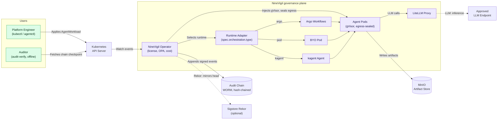

# Architecture

System design and components.

## Overview

NineVigil is a Kubernetes operator that runs autonomous AI agent workloads
under governance: sandboxed, egress-sealed, cost-attributed, and recorded in a
tamper-evident audit chain that an auditor can verify offline.

The Platform Engineer applies an `AgentWorkload`. The operator watches the API
server and picks the execution runtime from `spec.orchestration.type` through a
pluggable adapter: an Argo DAG for multi-step jobs, a bring-your-own single pod
for simple ones, or a kagent Agent. Whichever runs, the operator injects a
gVisor sandbox and a default-deny egress seal onto the agent pods, because that
governance is enforced at the pod and network layer, not the scheduler. Agent
pods reach only the approved LLM endpoint (via the LiteLLM proxy) and write
artifacts to MinIO. Every consequential action is appended to a hash-chained,
HMAC-signed audit chain, with the chain head optionally mirrored to Sigstore
Rekor. An auditor fetches the published checkpoint and verifies the whole chain
offline with `audit-verify`, no trust in the cluster required.

## Runtimes and the adapter contract

The execution runtime is pluggable. The operator selects it from
`spec.orchestration.type` through a registry of `RuntimeAdapter` implementations
in `pkg/runtime`.

- `argo` (default): multi-step DAG workflows via Argo. Use it for parallel or
  long-running agent jobs.
- `pod`: a bring-your-own single pod. Use it for simple, single-shot agents. The
  pod image comes from the `NINEVIGIL_AGENT_IMAGE` env var.
- `kagent`: runs the workload as a kagent `Agent` (`kagent.dev/v1alpha2`) in BYO
  mode, created through the unstructured client with no Go dependency on kagent.
  Requires kagent installed in the cluster. Same image source, same seal.

All three stamp the same governance labels onto their pods through a shared
helper, so the gVisor sandbox and the default-deny egress policy apply
identically. Engineering rule: never hardcode a runtime in the controller. Add a
runtime by implementing `runtime.RuntimeAdapter` and registering it in the
registry, not by adding a branch in `Reconcile`. Governance is applied at the pod
and network layer, so every adapter is governed identically without per-adapter
seal code.

## Components

### AgentWorkloadReconciler
Manages individual workload lifecycle:
- Task classification
- Model routing
- Provider execution
- Cost tracking
- Quality evaluation

### TenantReconciler
Provisions and manages tenants:
- Namespace creation
- Secret distribution
- RBAC configuration
- Quota enforcement
- SLA monitoring

### License Validator
Enforces licensing:
- JWT verification
- Tier validation
- Seat limits
- Expiry checks

### Cost Tracker
Tracks token usage:
- Per-provider accounting
- Monthly aggregation
- Quota enforcement
- Billing metrics

## Data Flow

1. **Workload Creation** → AgentWorkload CRD submitted
2. **Validation** → License check, policy evaluation
3. **Classification** → Task categorized (analysis/reasoning/validation)
4. **Routing** → Model selected based on strategy
5. **Execution** → Provider API called
6. **Evaluation** → Quality scored
7. **Completion** → Status updated, metrics recorded

For detailed flows, see respective controller documentation.
