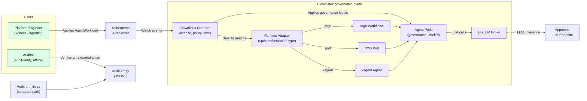

# Architecture

System design and components.

## Overview

Clawdlinux is a Kubernetes operator for governed agent workloads. The current
repository provides runtime adapters, admission and network configuration,
cost-reporting paths, workload status, and offline audit verification primitives.

The Platform Engineer applies an `AgentWorkload`. The operator selects an Argo,
pod, or kagent adapter from `spec.orchestration.type`. Adapters stamp shared
governance labels. The admission webhook and network-policy templates consume
those labels.

Actual gVisor isolation requires `runsc` on the nodes. Network enforcement
depends on the cluster CNI. The audit package and JSONL verifier are implemented,
but the controller does not append each workload event into the chain.

## Runtimes and the adapter contract

The execution runtime is pluggable. The operator selects it from
`spec.orchestration.type` through a registry of `RuntimeAdapter` implementations
in `pkg/runtime`.

- `argo` (default): multi-step DAG workflows via Argo. Use it for parallel or
  long-running agent jobs.
- `pod`: a bring-your-own single pod. Use it for simple, single-shot agents. The
  pod image comes from the `CLAWDLINUX_AGENT_IMAGE` env var.
- `kagent`: runs the workload as a kagent `Agent` (`kagent.dev/v1alpha2`) in BYO
  mode, created through the unstructured client with no Go dependency on kagent.
  Requires kagent installed in the cluster. The adapter applies shared governance labels.

All three stamp shared governance labels through one helper. Those labels opt
pods into common admission and network configuration. Enforcement still depends
on the customer's node runtime and CNI.

Never hardcode a runtime in the controller. Add a runtime by implementing
`runtime.RuntimeAdapter` and registering it in the registry.

## Components

### AgentWorkloadReconciler
Manages individual workload lifecycle:
- Task classification
- Model routing
- Provider execution
- Cost tracking
- Quality evaluation

### TenantReconciler
Provisions and manages tenants:
- Namespace creation
- Secret distribution
- RBAC configuration
- CPU, memory, and pod ResourceQuota creation
- Tenant status updates

### License Validator
License validation interface:
- No-op by default in the open-source reconciler
- Offline JWT validation when a production validator is configured

### Cost Tracker
Cost reporting interface:
- No-op by default
- Volatile in-memory reporter for demos
- Durable reporting supplied by an external implementation

## Data Flow

1. **Workload Creation**: AgentWorkload CRD submitted.
2. **Validation**: license and configured budget interfaces checked.
3. **Runtime path**: `argo`, `pod`, or `kagent` adapter selected when configured.
4. **Legacy direct path**: task classified, model routed, and action evaluated.
5. **Completion**: workload status and available metrics updated.

Audit capture is not part of either complete path today.

For detailed flows, see respective controller documentation.
