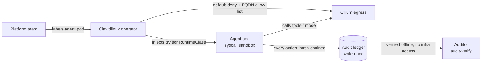

# Getting AI agents past a security review on Kubernetes

Agents work now. What does not work is getting one past a security review.

That gap is the whole problem. A demo agent that books a meeting is easy. An
agent with tools, a shell, and a live credential, running next to your
production workloads, is a lateral-movement incident waiting to happen. Security
teams know this, so they say no. The project stalls.

The numbers back the frustration up.

- Gartner (Jun 2025) predicts over 40% of agentic AI projects get cancelled by
  end of 2027, and names inadequate risk controls as a driver.
- An AIRQ assessment via Help Net Security (Jun 2026) found only 11 of 100
  production agents passed a security bar. 98% carried the "lethal trifecta":
  private data access, exposure to untrusted content, and outbound actions.
- A US bank self-reported to its regulator after an agent sent customer data to
  an unauthorized AI app (The Register, May 2026).
- Fed SR 26-2 (Apr 2026) updated model risk guidance but excludes generative and
  agentic AI, so examiners are improvising.

Demand is climbing. The controls are not keeping up. That is the gap.

## Why cloud-native teams feel this first

If you run Kubernetes, you already have the primitives to contain a workload.
Namespaces, NetworkPolicies, RuntimeClasses, admission control, RBAC. The
problem is that nobody wires them together for agents by default. So the agent
lands as a normal pod, with a normal service account, on a normal node, with
egress to the internet and a token in its environment.

That is the blast radius. One prompt injection and the agent is your attacker,
with your credentials, inside your perimeter.

## The approach: a governance plane, not another agent framework

Clawdlinux is a Kubernetes operator that wraps agent workloads in the controls
you want before you trust one in production. It is not a runtime. It sits under
whatever runtime you already use, and it enforces the same controls at the pod
and network layer, not at the scheduler. So the behavior is identical whether
the agent runs as an Argo workflow, a bring-your-own pod, or a kagent Agent.

Three controls, plus cost. Every claim points at code in a public repo.

**1. Agents run sandboxed.** An admission webhook injects a gVisor
`RuntimeClass` onto labeled agent pods. The agent's code runs in a syscall
sandbox, not straight on your node. One label opts a pod in. See
`internal/admission/runtimeclass_injector.go`.

**2. Network access is declared, not discovered.** The operator ships
default-deny egress and a Cilium FQDN allow-list, generated per workload. If a
destination is not in the manifest, the agent cannot reach it. The manifest is a
reviewable object, so security signs off before anything ships.

**3. The audit is one an auditor can verify offline.** Every action appends to a
hash-chained, write-once ledger. A standalone `audit-verify` binary replays the
whole chain with zero access to your infrastructure. An auditor confirms what an
agent did months later, inside an air-gapped cluster. No "trust me." See
`cmd/audit-verify`.

**Plus cost per agent.** When the bill spikes, you know which workload did it.

## How a run is contained



The seal and the attestation are identical across runtimes because they live at
the pod and network layer. Swap the runtime and the guarantees do not change.

## Honest state

This is early. Self-hosted and air-gapped first, because the buyers who need
verifiable evidence most are often the ones who cannot use a hosted control
plane. The controls above are in the public repo and you can read them tonight.
Some parts of the target contract are further along than others, and we label
every boundary rather than paper over it. If you are evaluating this, attack the
audit chain like a hostile auditor. That is the point.

## The token side, and a thing you can use today

Agents also burn context on verbose tool schemas and system state. Raw JSON,
YAML, and dashboards are built for humans. Agents pay for the braces, quotes, and
commas in tokens.

We measured a line-oriented alternative, Agent Native Format (ANF), against a
plain MCP `initialize` + `tools/list` baseline on the same tools, counted with
`tiktoken/cl100k_base` using the same encoder on both sides:

- 64.7% to 97.4% fewer tool-context tokens across five scenarios.
- 1 round trip before the first task action, instead of up to 21.

Be straight about where that comes from. Most of the win is scoping, loading
only the tools a task needs, plus dropping JSON syntax. It is not a magic
compact notation. Recent research on such formats shows the notation tricks save
less than people hope and can hurt accuracy. So we do not sell a format. We scope
and compact.

That piece is open source and usable right now. `anf-mcp` is a small, stateless
MCP server that exposes ANF encoding as tools, so any MCP client (Claude, Cursor,
VS Code, Codex) can compress state before it hits the context window. Apache-2.0,
no dependencies:

```sh
go install github.com/Clawdlinux/agent-native-format/cmd/anf-mcp@latest
```

Point your client at it and call `anf_encode`.

## Where this runs

Runtime-agnostic by design. kagent, Argo, or your own labeled pods all get the
same sandbox, the same sealed egress, and the same offline-verifiable audit. The
operator is open source. Come read it, and come break it.

- Operator: github.com/Clawdlinux/agentic-operator-core
- ANF and the MCP server: github.com/Clawdlinux/agent-native-format
